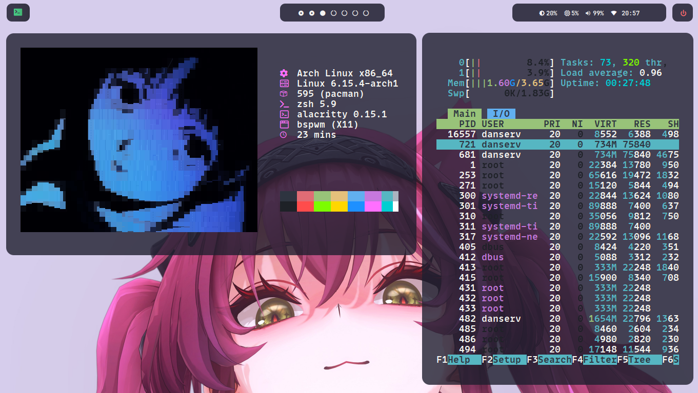
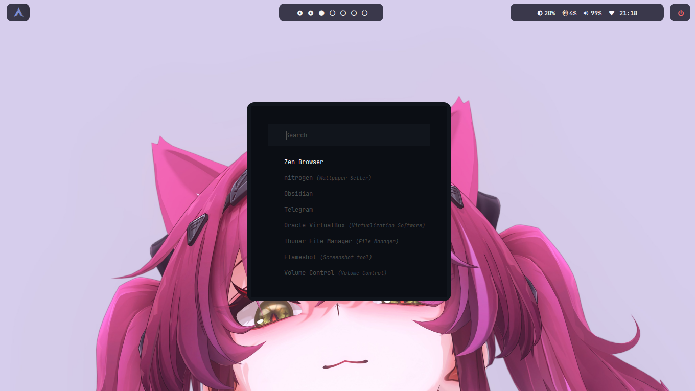
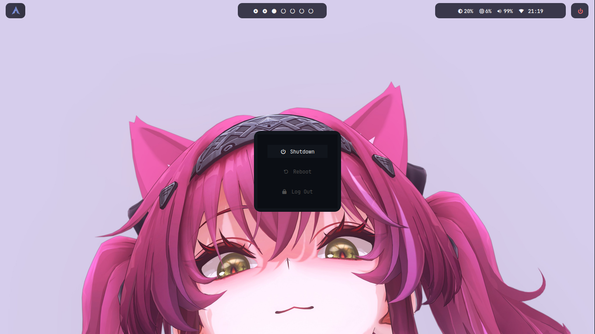

# 🛠️ Daniel's Dotfiles

Bienvenido a mis dotfiles — una colección organizada y minimalista para configurar rápidamente mi entorno en Arch Linux con BSPWM, Zsh y herramientas ligeras.
---









---

## 🌌 Filosofía

* ✨ Minimalismo: solo lo necesario, sin bloat
* 🌎 Portabilidad: instalar todo en una nueva máquina en segundos
* 🔐 Reversibilidad: sin miedo a perder configuraciones anteriores
* ⚖️ Modularidad: cada herramienta tiene su carpeta separada

---

## 📂 Contenido

Este repositorio incluye configuraciones para:

* 🔺 Window Manager: `bspwm`, `sxhkd`, `polybar`, `picom`, `dunst`
* 🕁 Terminal y shell: `zsh`, `powerlevel10k`, `alacritty`, `fastfetch`
* 🗒 Edición y navegación: `nvim`, `ranger`, `rofi`, `obsidian`
* 🚀 Scripts personales: Scripts en `~/.config/Scripts`
* 🌟 Personalización: wallpapers en `~/Wallpapers`

---

## ✨ Instalación en nueva máquina

1. Clona el repositorio:

```bash
git clone https://github.com/tuusuario/dotfiles.git ~/dotfiles
cd ~/dotfiles
```

2. Instala `stow` si no lo tienes:

```bash
sudo pacman -S stow
```

3. Ejecuta el script:

```bash
./bootstrap.sh
```

🚫 Esto **no sobrescribe** archivos existentes sin respaldo: los mueve a una carpeta como `~/dotfiles_backup_20250723_2345`.

---

## 🌐 Estructura del repositorio

```
dotfiles/
├── zsh/                  → .zshrc, .p10k.zsh
├── bspwm/                → .config/bspwm/
├── sxhkd/                → .config/sxhkd/
├── alacritty/            → .config/alacritty/
├── picom/, polybar/, etc
├── nvim/, rofi/, ranger/
├── scripts/.config/Scripts/
├── wallpapers/
├── RiceInstall.sh
├── crear_dotfiles.sh
├── .gitignore
└── README.md
```

---

## 🚫 Fuentes (fonts)

Las fuentes del sistema (como `TTF`) **no se incluyen automáticamente** por seguridad.

Puedes copiarlas manualmente:

```bash
sudo cp -r fonts/usr/share/fonts/TTF/* /usr/share/fonts/TTF/
sudo fc-cache -fv
```

---

## 🚀 Scripts incluidos

* `RiceInstall`: enlaza los dotfiles de forma segura y hace backup
* `crear_dotfiles.sh`: extrae tu configuración actual y la organiza como repo

---

## 🌐 Licencia

Uso personal. Puedes usarlo como referencia, pero asegúrate de revisar las configuraciones antes de usar en tu sistema.

---

Gracias por visitar mis dotfiles ✨

— Daniel
